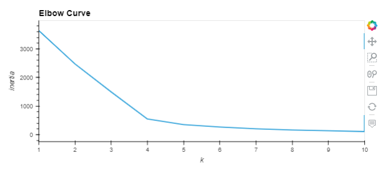
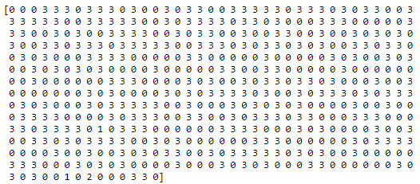
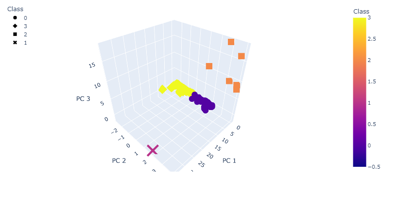
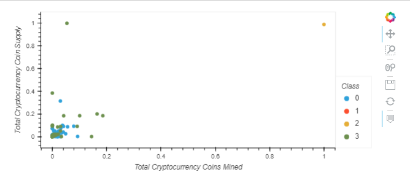

# Cryptocurrencies

# Overview of the analysis
 A prominent investment bank is interested in offering a new cryptocurrency investment portfolio for its customers. The company needs help in creating a report that includes what cryptocurrencies are on the trading market and how they could be grouped to create a classification system for this new investment. Since there is no known output for what the company is looking for, unsupervised learning clustering algorithms will be used to group the vast universe of cryptocurrencies.

The technical analysis deliverables required to complete the Cryptocurrencies analysis include:  

1. Preprocessing the Data for Principal Component Analysis (PCA).
2. Reducing Data Dimensions Using PCA.
3. Clustering Cryptocurrencies Using K-means.
4. Visualizing Cryptocurrencies Results.

## Resources
- Data Source: This analysis was performed using the  [crypto_data](https://github.com/aobasuyi/Cryptocurrencies/tree/main/Resources) dataset.
- Software: Python 3.7, Visual Studio Code 1.50.0, Anaconda 4.8.5, Jupyter Notebook 6.1.4 and Pandas

## Results: 

### Clustering Crytocurrencies Using K-Means: 

#### Finding the Best Value for k Using the Elbow Curve: 

    

- Running predictions K-Means with k=4: 
    

#### Visualizing Cryptocurrencies Results: 
- 3D-Scatter with Clusters  
    

- Scatter plot of "TotalCoinsMined" vs "TotalCoinSupply"  
    

- Cryptocurrencies DataFrame that holds the predictions  
    